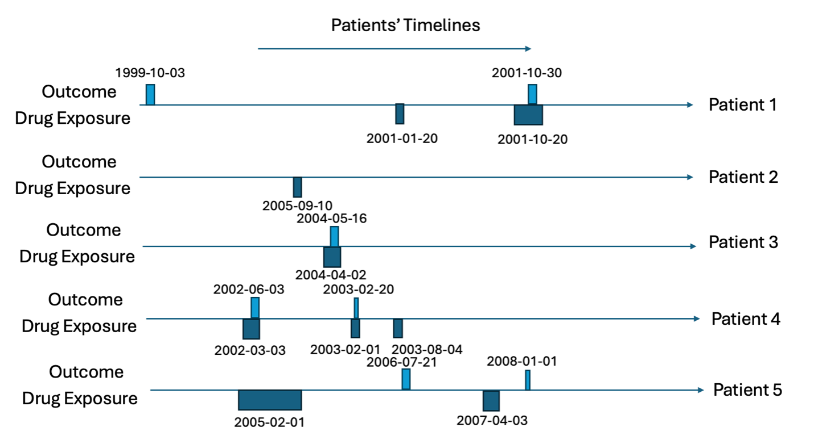
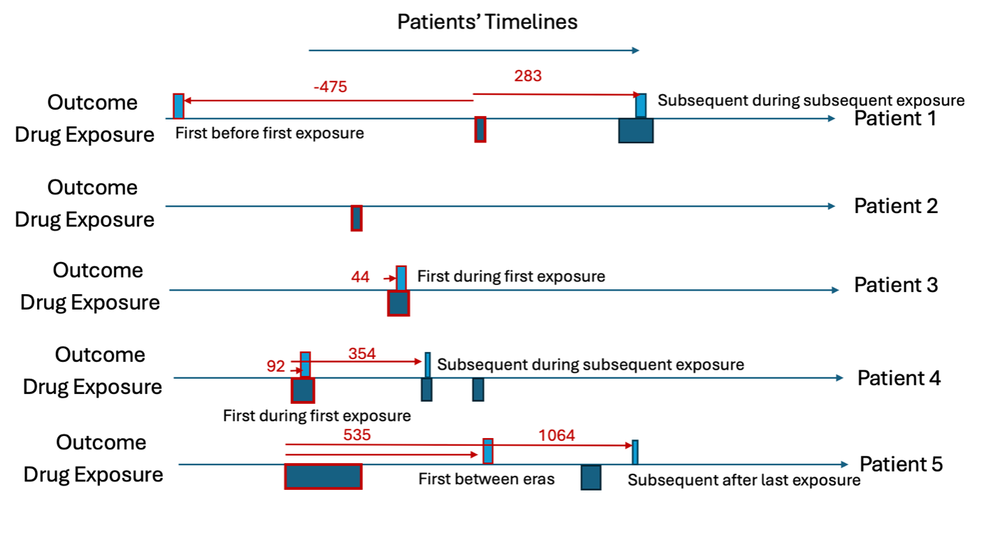
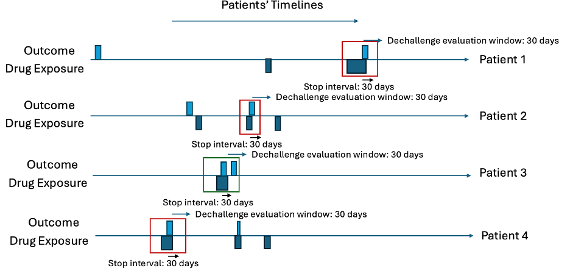
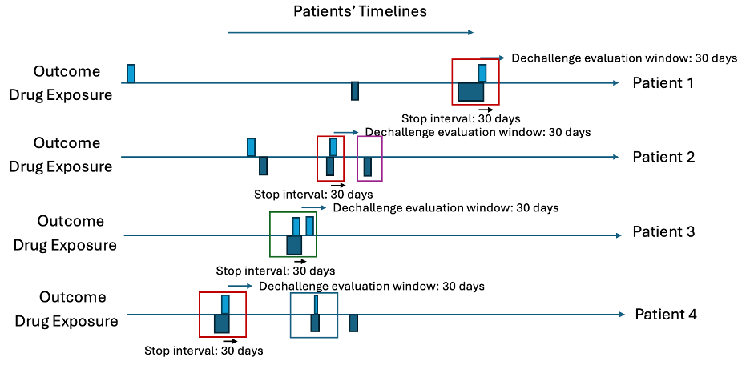

# Time-to-event

## Inputs

A vector of targetIds and a vector of outcomeIds

## Output

Summary data.frame with the counts of how often an outcome occurred within a time-period relative to the first target index date for each combination of target and outcome. The counts are stratified by whether the outcome was first event or subsequent and the timing category for when the outcome occurred (before first target exposure, during first target exposure, during a subsequent target exposure, between target exposures and after last target exposure).

## Worked Example

### Example Inputs

Here we consider the inputs are:

```{r}
targetIds <- c(1)
outcomeIds <- c(2) 
```

Consider we have five patients; the target cohort (dates each of the five patients are exposed to a drug) is in Table 1 and the outcome cohort (dates each of the five patients have the outcome) is in Table 2. This is also illustrated in Figures 1 and 2.

### Example Data Image





### Example Data Table

```{r echo=FALSE, results='asis'}

tteTargetData <- data.frame(
  patientId = c(1, 1, 2, 3, 4, 4, 4, 5, 5),
  cohortDefinitionId = rep(1, 9),
  cohortStartDate = c('2001-01-20', '2001-10-20',
                      '2005-09-10', '2004-04-02',
                      '2002-03-03', '2003-02-01',
                      '2003-08-04', '2005-02-01',
                      '2007-04-03'),
  cohortEndDate = c('2001-01-25', '2001-12-05',
                    '2005-09-15', '2004-05-17',
                    '2002-06-12', '2003-02-30',
                    '2003-08-24', '2005-10-08',
                    '2007-05-03')
  )

knitr::kable(
  x = tteTargetData, 
  caption = 'Example time-to-event data with dates.'
    )

```

```{r echo=FALSE, results='asis'}
tteOutcomeData <- data.frame(
  patientId = c(1, 1, 3, 4, 4, 5, 5),
  cohortDefinitionId = rep(2, 7),
  cohortStartDate = c('1999-10-03', '2001-10-30',
                      '2004-05-16', '2002-06-03',
                      '2003-02-20', '2006-07-21',
                      '2008-01-01'),
  cohortEndDate = c('1999-10-08', '2001-11-07',
                    '2004-05-18', '2002-06-14',
                    '2003-03-01', '2006-08-03',
                    '2008-01-09')
  )

knitr::kable(
  x = tteOutcomeData, 
  caption = 'Example time-to-event data with timing.'
    )

```

For all rows in the outcome table, we calculate the time between the patients first exposure in the target cohort and the outcome date (time-to-event), we classify the ‘type’ as the timing of when the outcome occurs with ‘before first exposure’ meaning the outcome occurs before the patient is observed in the target cohort, ‘during first’ means the outcome occurs during the first target cohort exposure, ‘between eras’ means the outcome occurs between target exposures, ‘during subsequent’ means the outcome occurs during a non-first target exposure and ‘after last exposure’ means the outcome occurs after the last exposure in the target cohort’s end date for the patient. The outcome type is classified whether the outcome is the ‘first occurrence’ or a ‘subsequent occurrence’. Let’s consider patient 1, he has the outcome twice. The first outcome occurs 475 days before his first target exposure and his second outcome occurs 283 days after his first target exposure. The second outcome for patient 1 occurs during a subsequent target exposure era (not the first). Patient 2 does not have the outcome so does not contribute to the time-to-event. Patient 3 has her first (and only) outcome during the first exposure to the drug and 44 days after she started the drug for the first time. Patient 4 has the outcome twice, 92 days after the first exposure to the drug and 354 days after. The first time she has the outcome is during the first exposure to the drug and the subsequent time she has the outcome is during her second exposure (subsequent exposure). Patient 5 has the outcome twice, 535 days after he is first exposure to the drug and 1064 days after. The first time he has the outcome occurs between drug exposure eras and the subsequent outcome occurs after the last exposure era. This is summarized in Table 3.

```{r echo=FALSE, results='asis'}
tteSummaryData <- data.frame(
  patientId = c(1, 1, 3, 4, 4, 5, 5),
  outcomeDate = c('1999-10-03', '2001-10-30',
                  '2004-05-16', '2002-06-03', 
                  '2003-02-20', '2006-07-21',
                  '2008-01-01'),
  firstExposureDate = c('2001-01-20', '2001-01-20',
                        '2004-04-02', '2002-03-03',
                        '2002-03-03', '2005-02-01',
                        '2005-02-01'),
  timeToEvent = c(-475, 283, 44, 92, 354, 535,
                  1064),
  type = c('Before first exposure',
           'During subsequent',
           'During first',
           'During first',
           'During subsequent',
           'Between eras',
           'After last exposure'),
  outcomeType = c('First',
                  'Subsequent',
                  'First',
                  'First',
                  'Subsequent',
                  'First',
                  'Subsequent')
  )

knitr::kable(
  x = tteSummaryData, 
  caption = 'Table 3: Time-to-event intermediate summary.'
    )

```

The time-to-event output aggregates the summary table into three different perspectives:

-   1-day aggregate – this calculates the total number of patients that have the outcome at each time-to-event day grouped by type and outcome type. Only looks at outcomes between -100 days and 100 days for the time-to-event.

-   30-day aggregate – this calculates the total number of patients that have the outcome at each 30-day sliding window for time-to-event (e.g., 0-29, 30-59, 60-89, etc.) grouped by type and outcome type. Only looks at outcomes between -1095 days and 1095 days for the time-to-event.

-   365-day aggregate – this calculates the total number of patients that have the outcome at each 365-day sliding window for time-to-event (e.g., 0-365, 366-730, 731-1095, etc.) grouped by type and outcome type. Only looks at outcomes between -1095 days and 1095 days for the time-to-event.

The summary results that would be output by time-to-event are displayed in Table 4.

```{r echo=FALSE, results='asis'}
tteResultData <- data.frame(
  timeType = c(
    rep('1-day', 2), 
    rep('30-day', 7),
    rep('365-day', 5)
    ),
  Type = c(
    'During first',
    'During first',
    'Before first exposure',
    'During first',
    'During first',
    'During subsequent', 
    'During subsequent',
    'Between eras',
    'After last exposure',
    'Before first exposure',
    'During first',
    'During subsequent' ,
    'Between eras',
    'After last exposure'
  ),
  outcomeType = c(
    'First',
    'First',
    'First',
    'First',
    'First',
    'Subsequent',
    'Subsequent',
    'First',
    'Subsequent',
    'First',
    'First',
    'Subsequent',
    'First',
    'Subsequent'
  ),
  timeStart = c(44, 92, -481, 31, 91,
                271, 331, 511, 1051, -731,
                1, 1, 366, 731),
  timeEnd = c(44, 92, -450, 60, 120,
              300, 360, 540, 1080, -365,
              365, 365, 730, 1095),
  count = c(1, 1, 1, 1, 1,
            1, 1, 1, 1, 1, 
            2, 2, 1, 1)
  )

knitr::kable(
  x = tteResultData, 
  caption = 'Table 4: Time-to-event output.'
    )

```

# Dechallenge-rechallenge

## Inputs

A vector of targetIds, a vector of outcomeIds, an integer dechallengeStopInterval and an integer dechallengeEvaluationWindow.

## Output

A summary data.frame with the number of dechallenge and rechallenge attempts per target and outcome combination plus the number of dechallange/rechallenge attempts that were successes and failures.

## Worked Example

The dechallenge-rechallenge analysis finds out how often a patient stops the drug due to the occurrence of an outcome and whether the outcome stops, then it looks at whether people re-exposed have the outcome start again. In observational data we infer these situations by finding cases where a patient has the outcome recorded during a drug exposure and seems to stop the drug within \<dechallenge stop interval days – default 30 days\> after the outcome occurs. For patients who have a dechallenge, we then determine whether it is a success (the outcome stops) or a failure (the outcome continues). This is determined by seeing whether the outcome starts within \<decallenge evaluation window days – default 30 days\> after the exposure ends (outcome starting is a dechallenge failure otherwise it is a success). For patients who had a dechallenge, we then look at whether they have another exposure (after decallenge evaluation window days from the first exposure end), which is a rechallenge and this is classed as a failure (if the outcome does not start during the rechallenge exposure era) and a success (if the outcome does occur during the rechallenge exposure era).

### Example Inputs

Here we consider the inputs are:

```{r}
targetIds <- c(1)
outcomeIds <- c(2) 
dechallengeStopInterval <- 30
dechallengeEvaluationWindow <- 31
```

### Example Data Plot


### Example Data Table

```{r echo=FALSE, results='asis'}

dcrcTargetData <- data.frame(
  patientId = c(1, 1, 2,2,2, 3, 4, 4, 4, 5, 5),
  cohortDefinitionId = rep(1, 11),
  cohortStartDate = c('2001-01-20', '2001-10-20',
                      '2005-09-10', '2006-03-04', '2006-05-03',
                      '2004-04-02',
                      '2002-03-03', '2003-02-01', '2003-08-04', 
                      '2005-02-01','2007-04-03'
                      ),
  cohortEndDate = c('2001-01-25', '2001-12-05',
                    '2005-09-15','2006-03-21', '2006-05-05', 
                    '2004-05-17',
                    '2002-06-12', '2003-02-30',
                    '2003-08-24', '2005-10-08',
                    '2007-05-03')
  )

knitr::kable(
  x = dcrcTargetData, 
  caption = 'Example dechallenge-rechallenge data with dates.'
    )

```

```{r echo=FALSE, results='asis'}
dcrcOutcomeData <- data.frame(
  patientId = c(1, 1, 2,2,3, 3,4, 4, 5, 5),
  cohortDefinitionId = rep(2, 10),
  cohortStartDate = c('1999-10-03', '2001-11-30',
                      '2005-07-01', '2006-03-10',
                      '2004-05-16', '2004-06-12',
                      '2002-06-03',
                      '2003-02-20', '2006-07-21',
                      '2008-01-01')
  )

knitr::kable(
  x = tteOutcomeData, 
  caption = 'Example time-to-event data with timing.'
    )

```

Let’s consider ten patients in Table 5 and Table 6 with 30 days for the dechallenge stop interval and 31 days for the decallenge evaluation window. First, find all cases where the outcome occurs during any exposure era and then the exposure ends within 30 days after the outcome start. These are the dechallenges. Then investigate whether a new outcome starts within 31 days of the exposure era ending. These are the failed dechallenges, otherwise the dechallenge is a success. Next, for the dechallenges, find any drug exposures that occur more than 31 days after the dechallenge exposure era end. These are rechallaneges. For each rechallenge, determine whether the outcome starts within 31 days of the rechallenge exposure era start. If an outcome occurs, the rechallenge is a success, otherwise it is a failure.

### Intermediary Table

```{r echo=FALSE, results='asis'}
dcrcSummaryData <- data.frame(
  patientId = c(1,2,3,4),
  outcomeDate = c('2001-11-30', '2006-03-10', 
                  '2004-05-16', '2002-06-03'),
  exposureEnd = c('2001-12-05', '2006-03-21',
                  '2004-05-17', '2002-06-12'),
  outcomeAfter = c('-','-', '2004-01-12', '-'),
  futureExposure = c('-', '2006-05-03', '-', '2003-01-01'),
  futureOutcome = c('-','-','-','2003-02-20'),
  dechallengeType = c('Success', 'Seccess', 'Fail', 'Success'),
  rechallengeType = c('-','Success', '-', 'Fail')
  )

knitr::kable(
  x = dcrcSummaryData, 
  caption = 'Dehcallenge-rechallenge summary table showing each dechallenge.  Only some patients with a dechallenge will have a rechallenge.'
    )

```

### Intermediary Plots





### Summary

We would then summarize the results by saying there were 4 dechallenges, 3 of which were a success and 1 of which was a fail. 2 patients had rechallenges with 1 being a fail and 1 being a success, see Table 8 as the example output for one target and outcome.

```{r echo=FALSE, results='asis'}
dcrcSummaryData2 <- data.frame(
  dechallengeAttempts = 4,	
  dechallengeSuccess	= 3,
  dechallengeFailure = 1,	
  rechallengeAttempts	= 2, 
  rechallengeSuccess = 1,
  rechallangeFailure = 1
)

knitr::kable(
  x = dcrcSummaryData2, 
  caption = 'Dehcallenge-rechallenge output.'
    )

```

**Note:** The way an outcome and exposure phenotype are designed can make it impossible or unlikely to see a dechallenge fail. For example, if an outcome is designed with a 365 day washout window, then it means there cannot be another outcome occurring within 365 days of another outcome. As a dechallange failure is the outcome occurring within dechallenge evaluation window days after the exposure ends (and the exposure must end within stop interval days of the outcome to be a dechallenge), then using the defaults for these values means a dechallenge failure requires an outcome to be possible within 60 days of the dechallenge outcome, which is impossible with a 365 washout window.

# Aggregate Covariates

## Inputs

A vector of targetIds plus the minimum prior observation required for the target cohorts and specifying which features to extract (covariateSettings).

## Outputs

For each target cohort restricted to only the patients with minimum prior observation at index and first occurrence the mean value for each feature of interest is extracted into a data.frame.

## Worked Example

The aggregate covariates calculates the mean value of a feature within a cohort of patients. In this analysis we restrict to first occurrence in the cohort with a minimum prior observation in days specified by the user (default 365 days). This restriction is implemented as otherwise a patient could contribute multiple times to the mean value and this makes interpretation difficult.

### Example Inputs

Here we consider the inputs are:

```{r}
minPriorObservation <- 365
covariateSettings <- FeatureExtraction::createCovariateSettings(
  useDemographicsAge = T, 
  useDemographicsGender = T,
  useConditionOccurrenceAnyTimePrior = T, includedCovariateConceptIds = c(201820)
  )
```

### Example Data

Let's assumed we have two two cohorts (id 1 and 2) the first cohort contains five patients who have \>365 days prior observation at index and the second contains three patients who have \>365 days prior observation at index.

The patients features' are displayed in Table 7, containing patients’ age at index, whether they have diabetes anytime prior to index and their sex as features.

```{r echo=FALSE, results='asis'}

targetData <- data.frame(
  patientId = c(1, 1, 1, 2, 2, 2, 3, 3, 3,
                4, 4, 4, 5, 5, 5, 1, 1, 1,
                2, 2, 2, 3, 3, 3),
  cohortId = c(rep(1,15), rep(2, 9)),
  feature = rep(c('age', 'sex', 'diabetes'),8),
  value = c(50, 'Male', 'Yes',
            18, 'Female', 'No',
            22, 'Male', 'No',
            40, 'Male', 'No',
            70, 'Female', 'Yes',
            24, 'Female', 'No',
            35, 'Female', 'No',
            31, 'Female', 'No')
  )

knitr::kable(
  x = targetData, 
  caption = 'Example patient level feature data.'
    )

```

### Results

We calculate the mean values for each feature per cohort:

```{r echo=FALSE, results='asis'}

meanData <- data.frame(
  cohortId = c(1, 1, 1, 2, 2, 2),
  feature = c('Age', 'Sex: Male', 'Diabetes: Yes',
              'Age', 'Sex: Male', 'Diabetes: Yes'), 
  mean = c(40, 0.60, 0.40, 30, 0, 0)
  )

knitr::kable(
  x = meanData, 
  caption = 'Example aggregate features for two example cohorts.'
    )

```

The database and cohort comparison implements the aggregate covariate analysis for all target and outcome ids fed into characterization across all OMOP CDM databases available and then lets users compare the mean values of the features between databases for the same cohort or across different cohorts within the same database. The standardized mean different is calculated between two cohorts when possible, this is calculated per feature as: abs(mean value in cohort 1 - mean value in cohort 2)/((standard deviation of values in cohort 1 squared plus standard deviation of values in cohort 2 squared)/2).

# Risk Factor Analysis

## Inputs

A vector of targetIds and outcomeIds plus the minimum prior observation required for the target cohorts, the outcome washout days for the outcomes, settings for the time-at-risk and covariate settings specifying which features to extract.

## Outputs

For each target and outcome combination we run aggregate covariate analysis for the special case of comparing patients in cohort 1 (patients in the target cohort for the first time with 365 days prior observation who go on to have the first occurrence of the outcome in washout days during some time-at-risk relative to the target cohort index) vs cohort 2 (patients in the target cohort for the first time with 365 days prior observation who do not go on to have the first occurrence of the outcome in washout days during some time-at-risk relative to the target cohort index).

## Worked Example

Lets consider an example with a time-at-risk of target cohort start + 1 to target cohort start + 180.

### Example Inputs

```{r}
targetId <- 1
outcomeId <- 2
minPriorObservation <- 365
outcomeWashoutDays <- 365
riskWindowStart <- 1
startAnchor <- 'cohort start'
riskWindowEnd <- 180
endAnchor <- 'cohort start'
covariateSettings <- FeatureExtraction::createCovariateSettings(
  useDemographicsAge = T, 
  useDemographicsGender = T,
  useConditionOccurrenceAnyTimePrior = T, includedCovariateConceptIds = c(201820)
  )
```

### Example Data

```{r echo=FALSE, results='asis'}

data <- data.frame(
  patientId = c(1, 1, 2, 3, 4, 4, 4, 5, 5),
  targetCohortId = rep(1,9),
  cohortStartDate = c('2001-01-20', '2001-10-20',
                      '2005-09-10', '2004-04-02',
                      '2002-03-03', '2003-02-01',
                      '2003-08-04', '2005-02-01',
                      '2007-04-03'),
  cohortEndDate = c('2001-01-25', '2001-12-05',
                    '2005-09-15', '2004-05-17',
                    '2002-06-12', '2003-02-30',
                    '2003-08-24', '2005-10-08',
                    '2007-05-03'),
  observationStart = c('2000-02-01', '2000-02-01',
                       '2001-02-01', '2001-02-01',
                       '2001-02-01', '2001-02-01',
                       '2001-02-01', '2001-02-01',
                       '2001-02-01')
  )

knitr::kable(
  x = data, 
  caption = 'Example target cohort.'
    )

```

```{r echo=FALSE, results='asis'}

data <- data.frame(
  patientId = c(1, 1, 3, 4, 4, 5, 5 ),
  targetCohortId = rep(2,7),
  cohortStartDate = c('1999-10-03', '2001-10-30',
                      '2004-05-16', '2002-06-03',
                      '2003-02-20', '2006-07-21',
                      '2008-01-01'
                      ),
  cohortEndDate = c('1999-10-08', '2001-11-07',
                    '2004-05-18', '2002-06-14',
                    '2003-03-01', '2006-08-03',
                    '2008-01-09')
  )

knitr::kable(
  x = data, 
  caption = 'Example outcome cohort.'
    )

```

### Intermedeiary Tables

First, we find the first target with 365 days prior obs.  Patient 1 is removed as they are exposed for the first time with less than 365 days prior observation.  Patients 4 and 5 non-first exposures are removed.  This leaves:

```{r echo=FALSE, results='asis'}

data <- data.frame(
  patientId = c(2, 3, 4, 5),
  targetCohortId = rep(1,4),
  cohortStartDate = c('2005-09-10', '2004-04-02',
                      '2002-03-03', '2005-02-01'),
  cohortEndDate = c('2005-09-15', '2004-05-17',
                    '2002-06-12','2005-10-08')
  )

knitr::kable(
  x = data, 
  caption = 'Example target cohort meeting risk factor inclusion criteria.'
    )

```

We then find the patients in the target cohort with the outcome and no-outcome occurring during 1 day to 180 days after index:

```{r echo=FALSE, results='asis'}

data <- data.frame(
  patientId = c(2, 3, 4, 5),
  targetCohortId = rep(1,4),
  cohortStartDate = c('2005-09-10', '2004-04-02',
                      '2002-03-03', '2005-02-01'),
  cohortEndDate = c('2005-09-15', '2004-05-17',
                    '2002-06-12','2005-10-08'),
  labels = c('Non-outcome', 'Outcome', 'Outcome',
             'Non-outcome')
  )

knitr::kable(
  x = data, 
  caption = 'Example target cohort meeting risk factor inclusion criteria.'
    )

```

**Note:** we also remove patients in the target who have the outcome during outcome washout days prior to target index. In the example, nobody had the outcome prior, so this was not observed.

If the features for these four patients are:

```{r echo=FALSE, results='asis'}

targetData <- data.frame(
  patientId = c(2,2,2,3,3,3,4,4,4,5,5,5),
  cohortId = c(rep('Non-outcome',3), rep('Outcome',3), rep('Outcome',3), rep('Non-outcome',3)),
  feature = rep(c('age', 'sex', 'diabetes'),4),
  value = c(50, 'Male', 'Yes',
            18, 'Female', 'No',
            22, 'Male', 'No',
            40, 'Male', 'No'
            )
  )

knitr::kable(
  x = targetData, 
  caption = 'Example patient level feature data.'
    )

```

### Results

We calculate the mean values for each feature per non-outcome and outcome cohort:

```{r echo=FALSE, results='asis'}

meanData <- data.frame(
  cohortId = c(rep('Outcome', 3), rep('Non-outcome',3)),
  feature = c('Age', 'Sex: Male', 'Diabetes: Yes',
              'Age', 'Sex: Male', 'Diabetes: Yes'), 
  mean = c(20, 0.50, 0, 45, 1, 0.5)
  )

knitr::kable(
  x = meanData, 
  caption = 'Example aggregate features for risk factor analysis.'
    )

```

We can then implement the standardized mean different calculated between the outcome and non-outcome cohorts, this is calculated per feature as: abs(mean value in outcome cohort - mean value in non-outcome cohort)/((standard deviation of values in outcome cohort squared plus standard deviation of values in non-outcome cohort squared)/2).


# Case Series 

The cases series looks at the patients in a target cohort who have the outcome during a specified time-at-risk and calculates the aggregate covariates at three different time periods: shortly before index, between target index and outcome index and shortly after outcome index.

## Inputs

A vector of targetIds and outcomeIds plus the minimum prior observation required for the target cohorts, the outcome washout days for the outcomes, settings for the time-at-risk and covariate settings specifying which features to extract.

In addition you need to specify how long before target index to extract before index features (preTargetIndexDays) and how long after outcome index to extract after index features
 (postOutcomeIndexDays).


## Outputs

For each target and outcome combination we run aggregate covariate analysis patients in the target patients (with a minimum of prior observation day before index) who have the outcome (for the first time in outcome washout days).  We use three different time periods for feature extraction:

* (before) preTargetIndexDays before target index up to target index
* (during) between target index plus 1 day to outcome index 
* (after) 1 day after outcome index to outcome index plus postOutcomeIndexDays 

## Worked Example

In this example we look at how often diabetes is recorded for the cases (people with the target cohort who have the outcome within 180 days of target index) in the year before target index, between target index and outcome index and the 1 year after outcome index.

### Example Inputs

Here we consider the inputs are:

```{r}
targetId <- 1
outcomeId <- 2
minPriorObservation <- 365
outcomeWashoutDays <- 365
preTargetIndexDays <- 365
postOutcomeIndexDays <- 365
riskWindowStart <- 1
startAnchor <- 'cohort start'
riskWindowEnd <- 180
endAnchor <- 'cohort start'
covariateSettings <- FeatureExtraction::createCovariateSettings(
  useConditionOccurrenceAnyTimePrior = T, includedCovariateConceptIds = c(201820)
  )
```

### Example Data

```{r echo=FALSE, results='asis'}

data <- data.frame(
  patientId = c(1, 1, 2, 3, 4, 4, 4, 5, 5),
  targetCohortId = rep(1,9),
  cohortStartDate = c('2001-01-20', '2001-10-20',
                      '2005-09-10', '2004-04-02',
                      '2002-03-03', '2003-02-01',
                      '2003-08-04', '2005-02-01',
                      '2007-04-03'),
  cohortEndDate = c('2001-01-25', '2001-12-05',
                    '2005-09-15', '2004-05-17',
                    '2002-06-12', '2003-02-30',
                    '2003-08-24', '2005-10-08',
                    '2007-05-03'),
  observationStart = c('2000-02-01', '2000-02-01',
                       '2001-02-01', '2001-02-01',
                       '2001-02-01', '2001-02-01',
                       '2001-02-01', '2001-02-01',
                       '2001-02-01')
  )

knitr::kable(
  x = data, 
  caption = 'Example target cohort.'
    )

```

```{r echo=FALSE, results='asis'}

data <- data.frame(
  patientId = c(1, 1, 3, 4, 4, 5, 5 ),
  targetCohortId = rep(2,7),
  cohortStartDate = c('1999-10-03', '2001-10-30',
                      '2004-05-16', '2002-06-03',
                      '2003-02-20', '2006-07-21',
                      '2008-01-01'
                      ),
  cohortEndDate = c('1999-10-08', '2001-11-07',
                    '2004-05-18', '2002-06-14',
                    '2003-03-01', '2006-08-03',
                    '2008-01-09')
  )

knitr::kable(
  x = data, 
  caption = 'Example outcome cohort.'
    )

```

### Intermedeiary Tables

First, we find the first target with 365 days prior obs.  Patient 1 is removed as they are exposed for the first time with less than 365 days prior observation.  Patients 4 and 5 non-first exposures are removed.  This leaves:

```{r echo=FALSE, results='asis'}

data <- data.frame(
  patientId = c(2, 3, 4, 5),
  targetCohortId = rep(1,4),
  cohortStartDate = c('2005-09-10', '2004-04-02',
                      '2002-03-03', '2005-02-01'),
  cohortEndDate = c('2005-09-15', '2004-05-17',
                    '2002-06-12','2005-10-08')
  )

knitr::kable(
  x = data, 
  caption = 'Example target cohort meeting risk factor inclusion criteria.'
    )

```

We then find the patients in the target cohort with the outcome occurring during 1 day to 180 days after index:

```{r echo=FALSE, results='asis'}

data <- data.frame(
  patientId = c(3, 4),
  targetCohortId = rep(1,2),
  cohortStartDate = c('2004-04-02',
                      '2002-03-03'),
  cohortEndDate = c('2004-05-17',
                    '2002-06-12'),
  labels = c('Outcome', 'Outcome')
  )

knitr::kable(
  x = data, 
  caption = 'Example target cohort meeting case inclusion criteria.'
    )

```

**Note:** we also remove patients in the target who have the outcome during outcome washout days prior to target index. In the example, nobody had the outcome prior, so this was not observed.

Now we define the before( 365 days before target index up to target index), between (target index plus 1 and outcome) and after (outcome index plus 1 to outcome index plus 365):

```{r echo=FALSE, results='asis'}

data <- data.frame(
  patientId = c(3, 4),
  targetCohortId = rep(1,2),
  targetStartDate = c('2004-04-02',
                      '2002-03-03'),
  outcomeStartDate = c('2004-05-16', 
                       '2002-06-03'),
  beforeStartDate = c("2003-04-03", "2001-03-03"),
  beforeEndDate = c('2004-04-02','2002-03-03'),
  duringStartDate = c('2004-04-03','2002-03-04'),
  duringEndDate = c('2004-05-16','2002-06-03'),
  afterStartDate = c('2004-05-17','2002-06-04'),
  afterEndDate = c("2005-05-16", "2003-06-03")
  )

knitr::kable(
  x = data, 
  caption = 'Example  cases with before/during/after dates.'
    )

```


If the features for these two patients at the three time periods are:

```{r echo=FALSE, results='asis'}

targetData <- data.frame(
  patientId = c(3,3,3,4,4,4),
  feature = rep(c('diabetes'),6),
  timePeriod = rep(c('before','during', 'after'),2),
  value = c('No', 'No', 'Yes',
            'Yes', 'Yes', 'Yes'
            )
  )

knitr::kable(
  x = targetData, 
  caption = 'Example patient level case feature data.'
    )

```

### Results

Finally, we aggregate over the time periods:

```{r echo=FALSE, results='asis'}

targetData <- data.frame(
  feature = rep(c('diabetes: Yes'),3),
  timePeriod = c('before', 'during', 'after'),
  value = c(0.5,0.5,1)
  )

knitr::kable(
  x = targetData, 
  caption = 'Example patient level case feature data.'
    )

```

